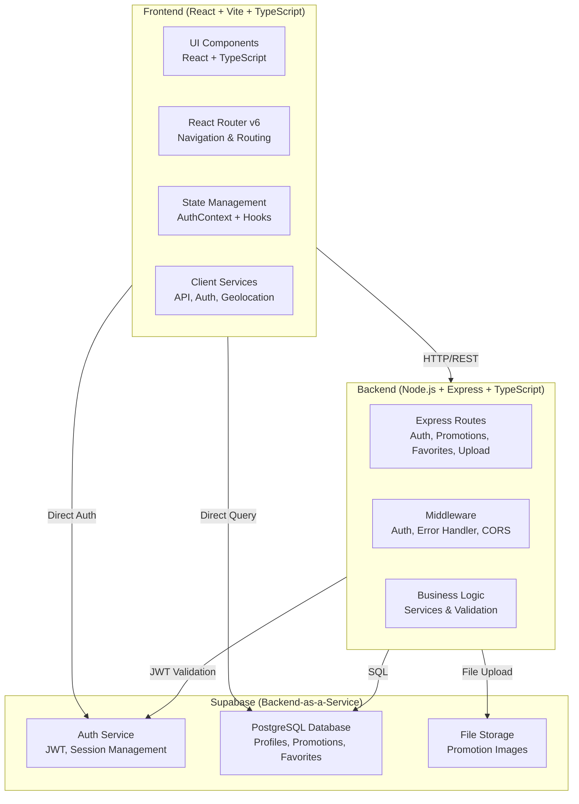
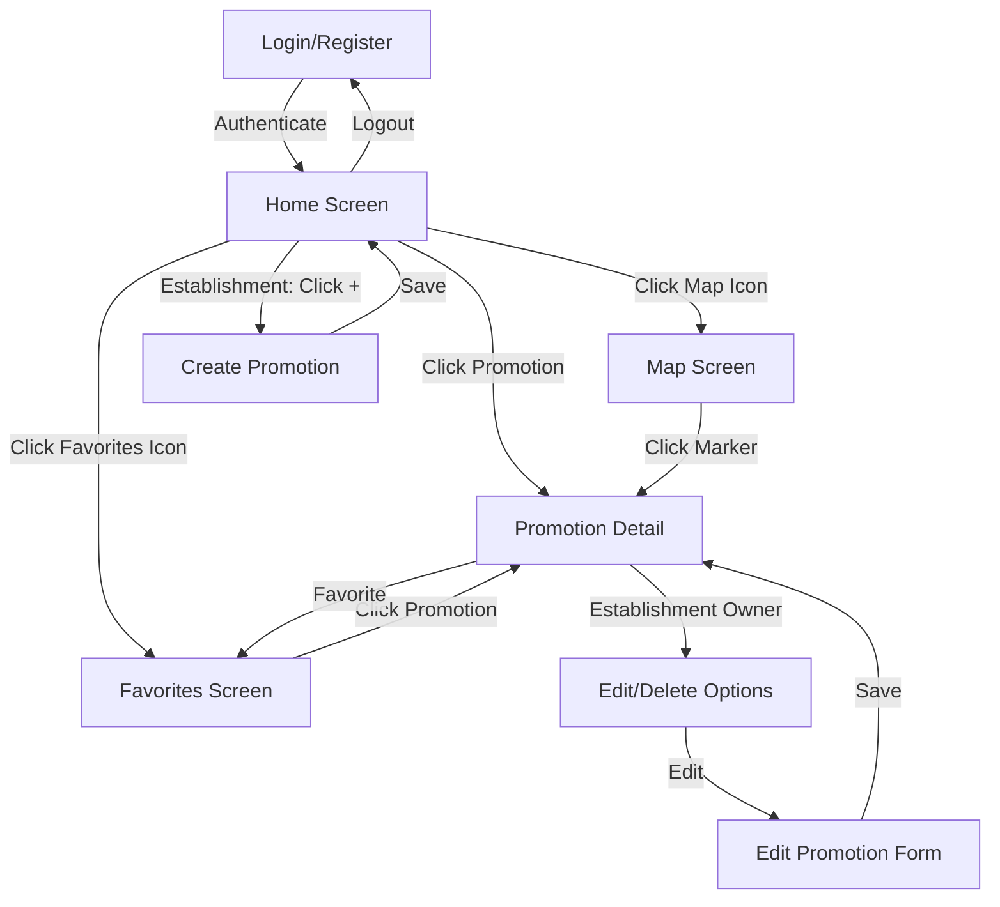

# Design Document: App Promoções

## Overview

App Promoções é um marketplace de promoções locais que conecta estabelecimentos comerciais a consumidores através de uma plataforma web moderna. O sistema é construído com uma arquitetura de três camadas: frontend React + Vite + TypeScript, backend Node.js + Express + TypeScript, e Supabase como Backend-as-a-Service (BaaS) fornecendo autenticação, banco de dados PostgreSQL e armazenamento de arquivos. A aplicação permite que lojistas publiquem promoções com imagens, preços, localização e categoria, enquanto consumidores navegam, favoritam e visualizam promoções em lista ou mapa interativo.

---

## Architecture Overview



### Technology Stack

**Frontend:**
- React 18+ with TypeScript
- Vite (build tool)
- React Router v6 (routing)
- React Hook Form + Zod (form validation)
- Tailwind CSS (styling)
- react-leaflet (map visualization)
- Supabase JS Client (auth & real-time)

**Backend:**
- Node.js with TypeScript
- Express.js (HTTP server)
- Multer (file upload handling)
- Supabase Admin SDK (database & storage)
- CORS (cross-origin requests)

**Database & Services:**
- Supabase (PostgreSQL, Auth, Storage)
- JWT for session management
- Geolocation API (browser native)

---

## Data Models

### User Profile

```typescript
interface UserProfile {
  id: string                    // UUID from Supabase Auth
  name: string                  // Full name
  email: string                 // Unique email
  cpf: string                   // 11 digits, unique
  role: 'user' | 'establishment'  // Consumer or merchant
  created_at: string            // ISO timestamp
}
```

**Validation Rules:**
- `name`: Required, non-empty string
- `email`: Required, valid email format (contains @ and domain)
- `cpf`: Required, exactly 11 numeric digits
- `role`: Must be either 'user' or 'establishment'

### Promotion

```typescript
interface Promotion {
  id: string                    // UUID
  title: string                 // Promotion title
  price: number                 // Positive decimal (max 10 digits, 2 decimals)
  store: string                 // Store/business name
  category: string              // One of 20 predefined categories
  image_url: string | null      // Primary image URL
  image_urls: string[] | null   // Array of all image URLs
  address: string | null        // Street address
  city: string | null           // City name
  state: string | null          // 2-letter state code
  cep: string | null            // 8 digits, no formatting
  latitude: number | null       // GPS coordinate
  longitude: number | null      // GPS coordinate
  user_id: string               // UUID of establishment owner
  created_at: string            // ISO timestamp
}
```

**Validation Rules:**
- `title`: Required, non-empty string
- `price`: Required, positive number > 0
- `store`: Required, non-empty string
- `category`: Required, must be one of 20 predefined categories
- `image_urls`: Accepted formats: JPEG, PNG, WebP
- `cep`: 8 digits only, no formatting
- `latitude` & `longitude`: Valid GPS coordinates or null

### Favorite

```typescript
interface Favorite {
  user_id: string               // UUID of user
  promotion_id: string          // UUID of promotion
  created_at: string            // ISO timestamp
}
```

**Constraints:**
- Composite primary key: (user_id, promotion_id)
- Cascade delete on user or promotion deletion

### Categories

```typescript
const CATEGORIES = [
  'Restaurantes',
  'Farmácias',
  'Serviços',
  'Supermercado',
  'Lojas',
  'Pizza',
  'Hambúrguer',
  'Carnes',
  'Frango',
  'Sushi',
  'Hortifruti',
  'Padaria',
  'Sorveteria',
  'Cafeteria',
  'Bebidas',
  'Eletrônicos',
  'Conveniência',
  'Lanchonete',
  'Frutos do Mar',
  'Outros'
]
```

---

## Component Structure

### Layout Components

#### Header
- Displays app logo/title
- Shows user profile icon (if authenticated)
- Logout button
- Responsive design for mobile

#### Footer
- Copyright information
- Links to policies (if applicable)
- Contact information

#### PageWrapper
- Wraps all pages with consistent layout
- Manages header/footer visibility
- Handles page transitions

#### Navigation Bar (Bottom)
- Visible only when authenticated
- Three main tabs: Home, Map, Favorites
- Active tab highlighting
- Icons for each section

### Feature Components

#### HeroBanner
- Displays most recent promotion (highest `created_at`)
- Shows: primary image, title, price, store name
- Clickable to navigate to Promotion_Detail
- Fallback message if no promotions exist
- Full-width responsive design

#### StoriesBar
- Horizontal scrollable list of 10 most recent promotions
- Each item: circular image thumbnail + store name below
- No visible scrollbar
- Clickable to navigate to Promotion_Detail
- Smooth horizontal scroll behavior

#### NetflixRow
- Horizontal scrollable list of promotions sorted by price (ascending)
- Each item: Promotion_Card component
- No visible scrollbar
- Clickable cards navigate to Promotion_Detail
- Smooth horizontal scroll behavior

#### CategoryFilter
- Horizontal scrollable list of 20 categories
- Each category: icon + label
- Single selection mode (toggle on/off)
- Filters promotions in real-time
- No visible scrollbar
- Selected category highlighted

#### PromotionCard
- Compact promotion display
- Shows: image, title, price, store name, category
- Clickable to navigate to Promotion_Detail
- Favorite button (for users with role 'user')
- Responsive sizing for different contexts

#### PromotionDetail
- Full promotion information display
- Image carousel (all images)
- Title, price, store name, category
- Complete address (street, city, state, CEP)
- Creation date
- Favorite button (for role 'user')
- Edit/Delete buttons (for owner establishment)
- Back button to previous screen

#### PromotionForm
- Create/Edit promotion form
- Fields: title, price, store, category, address, city, state, CEP, images
- Geolocation integration (auto-fill address)
- Image uploader with preview
- Form validation with error messages
- Submit button with loading state
- Cancel button

#### ImageUploader
- Multiple file selection
- Supported formats: JPEG, PNG, WebP
- Image preview before upload
- File type validation
- Error handling for failed uploads
- Progress indication during upload

#### CategoryFilter
- 20 category icons with labels
- Horizontal scrollable
- Single selection toggle
- Real-time filtering

### UI Components (Reusable)

#### Button
- Primary, secondary, danger variants
- Loading state
- Disabled state
- Responsive sizing

#### Card
- Container component
- Padding and border styling
- Shadow effects
- Responsive layout

#### Input
- Text input field
- Email input
- Number input
- Password input
- Error state styling
- Placeholder text

#### Skeleton
- Loading placeholder
- Matches component dimensions
- Animated shimmer effect

---

## Service Layer

### Authentication Service (`auth.ts`)

**Responsibilities:**
- Supabase Auth integration
- User signup with email/CPF/password
- User login with email or CPF
- Session persistence via JWT
- Token refresh on expiration
- Logout functionality

**Key Functions:**
```typescript
signUp(name: string, email: string, cpf: string, password: string, role: 'user' | 'establishment'): Promise<AuthUser>
login(emailOrCpf: string, password: string): Promise<AuthUser>
logout(): void
getSession(): { token: string | null; user: AuthUser | null }
refreshSession(): Promise<boolean>
```

### API Service (`api.ts`)

**Responsibilities:**
- HTTP client for backend communication
- Request/response interceptors
- JWT token injection in headers
- Error handling and logging

**Base URL:** `http://localhost:3333/api` (or production URL)

**Key Methods:**
```typescript
get<T>(path: string): Promise<{ data: T }>
post<T>(path: string, data: any): Promise<{ data: T }>
put<T>(path: string, data: any): Promise<{ data: T }>
delete<T>(path: string): Promise<{ data: T }>
```

### Promotions Service (`promotions.ts`)

**Responsibilities:**
- Fetch all promotions
- Fetch single promotion by ID
- Create new promotion
- Update existing promotion
- Delete promotion
- Filter by category
- Sort by price or date

**Key Functions:**
```typescript
getAllPromotions(): Promise<Promotion[]>
getPromotionById(id: string): Promise<Promotion>
createPromotion(data: CreatePromotionPayload): Promise<Promotion>
updatePromotion(id: string, data: UpdatePromotionPayload): Promise<Promotion>
deletePromotion(id: string): Promise<void>
getPromotionsByCategory(category: string): Promise<Promotion[]>
```

### Favorites Service (`favorites.ts`)

**Responsibilities:**
- Add promotion to favorites
- Remove promotion from favorites
- Fetch user's favorite promotions
- Check if promotion is favorited

**Key Functions:**
```typescript
addFavorite(promotionId: string): Promise<void>
removeFavorite(promotionId: string): Promise<void>
getFavorites(): Promise<Promotion[]>
isFavorited(promotionId: string): Promise<boolean>
```

### Geolocation Service (`geolocation.ts`)

**Responsibilities:**
- Request device location permission
- Get GPS coordinates
- Perform reverse geocoding (coordinates → address)
- Handle geolocation errors

**Key Functions:**
```typescript
requestLocation(): Promise<{ latitude: number; longitude: number }>
reverseGeocode(lat: number, lng: number): Promise<Address>
```

**Address Structure:**
```typescript
interface Address {
  street: string
  city: string
  state: string
  cep: string
}
```

### Image Upload Service (`upload.ts`)

**Responsibilities:**
- Upload images to Supabase Storage
- Validate file types
- Generate public URLs
- Handle upload errors

**Key Functions:**
```typescript
uploadImage(file: File): Promise<string>  // Returns public URL
uploadMultiple(files: File[]): Promise<string[]>
validateImageFile(file: File): boolean
```

---

## State Management

### AuthContext

**Purpose:** Manage global authentication state

**State:**
```typescript
interface AuthContextType {
  user: AuthUser | null
  profile: UserProfile | null
  role: UserRole | null
  loading: boolean
  isEstablishment: boolean
  signOut(): void
}
```

**Provider:** `AuthProvider` wraps entire app in `App.tsx`

**Usage:** `const { user, profile, isEstablishment } = useAuth()`

### Local Component State

**Home Screen:**
- `selectedCategory`: Current category filter
- `promotions`: List of promotions
- `loading`: Loading state
- `error`: Error message

**Promotion Detail:**
- `promotion`: Current promotion data
- `isFavorited`: Favorite status
- `loading`: Loading state

**Promotion Form:**
- `formData`: Form field values
- `images`: Selected image files
- `uploading`: Upload progress
- `errors`: Form validation errors

---

## API Endpoints

### Authentication Endpoints

**POST /api/auth/signup**
- Request: `{ name, email, cpf, password, role }`
- Response: `{ user, profile, token }`
- Status: 201 (Created)

**POST /api/auth/login**
- Request: `{ emailOrCpf, password }`
- Response: `{ user, profile, token }`
- Status: 200 (OK)

**POST /api/auth/logout**
- Request: (empty)
- Response: `{ message: "Logged out" }`
- Status: 200 (OK)

**GET /api/auth/me**
- Request: (requires JWT in Authorization header)
- Response: `{ user, profile }`
- Status: 200 (OK)

**POST /api/auth/refresh**
- Request: (requires refresh token)
- Response: `{ token }`
- Status: 200 (OK)

### Promotions Endpoints

**GET /api/promotions**
- Query params: `?category=string&sortBy=price|date&limit=number&offset=number`
- Response: `{ promotions: Promotion[], total: number }`
- Status: 200 (OK)

**GET /api/promotions/:id**
- Response: `{ promotion: Promotion }`
- Status: 200 (OK)
- Status: 404 (Not Found)

**POST /api/promotions**
- Request: `multipart/form-data` with fields: title, price, store, category, address, city, state, cep, latitude, longitude, images (files)
- Response: `{ promotion: Promotion }`
- Status: 201 (Created)
- Status: 401 (Unauthorized - invalid JWT)
- Status: 403 (Forbidden - user is not establishment)

**PUT /api/promotions/:id**
- Request: `multipart/form-data` with same fields as POST
- Response: `{ promotion: Promotion }`
- Status: 200 (OK)
- Status: 401 (Unauthorized)
- Status: 403 (Forbidden - not owner)
- Status: 404 (Not Found)

**DELETE /api/promotions/:id**
- Response: `{ message: "Promotion deleted" }`
- Status: 200 (OK)
- Status: 401 (Unauthorized)
- Status: 403 (Forbidden - not owner)
- Status: 404 (Not Found)

### Favorites Endpoints

**GET /api/favorites**
- Request: (requires JWT)
- Response: `{ favorites: Promotion[] }`
- Status: 200 (OK)

**POST /api/favorites/:promotionId**
- Request: (requires JWT)
- Response: `{ message: "Added to favorites" }`
- Status: 201 (Created)
- Status: 401 (Unauthorized)
- Status: 409 (Conflict - already favorited)

**DELETE /api/favorites/:promotionId**
- Request: (requires JWT)
- Response: `{ message: "Removed from favorites" }`
- Status: 200 (OK)
- Status: 401 (Unauthorized)
- Status: 404 (Not Found)

### Upload Endpoints

**POST /api/upload**
- Request: `multipart/form-data` with file field
- Response: `{ url: string }`
- Status: 201 (Created)
- Status: 400 (Bad Request - invalid file type)
- Status: 413 (Payload Too Large)

---

## Routing & Navigation

### Route Structure

```
/                           → Home Screen (protected)
/login                      → Login Page (public)
/register                   → Register Page (public)
/promotions/:id             → Promotion Detail (protected)
/promotions/new             → Create Promotion (protected, establishment only)
/promotions/:id/edit        → Edit Promotion (protected, establishment only)
/map                        → Map Screen (protected)
/favorites                  → Favorites Screen (protected)
*                           → Redirect to /
```

### Navigation Flow



### Protected Routes

Routes requiring authentication:
- `/` (Home)
- `/promotions/:id` (Detail)
- `/map` (Map)
- `/favorites` (Favorites)
- `/promotions/new` (Create - establishment only)
- `/promotions/:id/edit` (Edit - establishment only)

**Protection Logic:**
- If not authenticated → redirect to `/login`
- If establishment-only route and user is not establishment → redirect to `/`

---

## File Structure

```
app-promocoes/
├── frontend/
│   ├── src/
│   │   ├── components/
│   │   │   ├── features/
│   │   │   │   ├── HeroBanner.tsx
│   │   │   │   ├── StoriesBar.tsx
│   │   │   │   ├── NetflixRow.tsx
│   │   │   │   ├── CategoryFilter.tsx
│   │   │   │   ├── PromotionCard.tsx
│   │   │   │   └── index.ts
│   │   │   ├── layout/
│   │   │   │   ├── Header.tsx
│   │   │   │   ├── Footer.tsx
│   │   │   │   ├── PageWrapper.tsx
│   │   │   │   ├── NavigationBar.tsx
│   │   │   │   └── index.ts
│   │   │   └── ui/
│   │   │       ├── Button.tsx
│   │   │       ├── Card.tsx
│   │   │       ├── Input.tsx
│   │   │       ├── Skeleton.tsx
│   │   │       └── index.ts
│   │   ├── pages/
│   │   │   ├── Home.tsx
│   │   │   ├── Login.tsx
│   │   │   ├── Register.tsx
│   │   │   ├── PromotionDetail.tsx
│   │   │   ├── CreatePromotion.tsx
│   │   │   ├── Map.tsx
│   │   │   └── Favorites.tsx
│   │   ├── contexts/
│   │   │   └── AuthContext.tsx
│   │   ├── hooks/
│   │   │   ├── useAuth.ts
│   │   │   ├── usePromotions.ts
│   │   │   ├── useFavorites.ts
│   │   │   └── index.ts
│   │   ├── services/
│   │   │   ├── api.ts
│   │   │   ├── auth.ts
│   │   │   ├── promotions.ts
│   │   │   ├── favorites.ts
│   │   │   ├── geolocation.ts
│   │   │   ├── upload.ts
│   │   │   └── index.ts
│   │   ├── types/
│   │   │   ├── auth.ts
│   │   │   ├── promotion.ts
│   │   │   └── index.ts
│   │   ├── constants/
│   │   │   ├── categories.ts
│   │   │   └── index.ts
│   │   ├── App.tsx
│   │   ├── main.tsx
│   │   └── index.css
│   ├── index.html
│   ├── package.json
│   ├── tsconfig.json
│   ├── vite.config.ts
│   └── .env.example
│
├── backend/
│   ├── src/
│   │   ├── routes/
│   │   │   ├── auth.ts
│   │   │   ├── promotions.ts
│   │   │   ├── favorites.ts
│   │   │   ├── upload.ts
│   │   │   └── index.ts
│   │   ├── middlewares/
│   │   │   ├── authMiddleware.ts
│   │   │   ├── errorHandler.ts
│   │   │   └── index.ts
│   │   ├── services/
│   │   │   ├── supabase.ts
│   │   │   └── index.ts
│   │   ├── types/
│   │   │   ├── auth.ts
│   │   │   ├── promotion.ts
│   │   │   └── index.ts
│   │   └── server.ts
│   ├── package.json
│   ├── tsconfig.json
│   └── .env.example
│
├── database/
│   ├── schema.sql
│   ├── seed.sql
│   └── storage.sql
│
└── README.md
```

---

## Form Validation

### Signup Form

```typescript
interface SignupFormData {
  name: string              // Required, non-empty
  email: string             // Required, valid email
  cpf: string               // Required, exactly 11 digits
  password: string          // Required, min 6 characters
  confirmPassword: string   // Required, must match password
  role: 'user' | 'establishment'  // Required
}
```

**Validation Rules:**
- `name`: Non-empty string
- `email`: Valid email format (regex: `/^[^\s@]+@[^\s@]+\.[^\s@]+$/`)
- `cpf`: Exactly 11 numeric digits (regex: `/^\d{11}$/`)
- `password`: Minimum 6 characters
- `confirmPassword`: Must equal password

### Login Form

```typescript
interface LoginFormData {
  emailOrCpf: string        // Required, email or 11-digit CPF
  password: string          // Required, non-empty
}
```

**Validation Rules:**
- `emailOrCpf`: Valid email OR exactly 11 digits
- `password`: Non-empty string

### Promotion Form

```typescript
interface PromotionFormData {
  title: string             // Required, non-empty
  price: number             // Required, positive number
  store: string             // Required, non-empty
  category: string          // Required, one of 20 categories
  address?: string          // Optional
  city?: string             // Optional
  state?: string            // Optional, 2 letters
  cep?: string              // Optional, 8 digits
  latitude?: number         // Optional, valid GPS
  longitude?: number        // Optional, valid GPS
  images?: File[]           // Optional, JPEG/PNG/WebP
}
```

**Validation Rules:**
- `title`: Non-empty string
- `price`: Positive number > 0
- `store`: Non-empty string
- `category`: Must be one of 20 predefined categories
- `state`: If provided, exactly 2 letters
- `cep`: If provided, exactly 8 digits
- `images`: If provided, only JPEG, PNG, WebP formats

---

## Error Handling

### Frontend Error Handling

**HTTP Errors:**
- 400 Bad Request → Display validation error message
- 401 Unauthorized → Redirect to login
- 403 Forbidden → Display "Access denied" message
- 404 Not Found → Display "Resource not found" message
- 500 Server Error → Display "Server error, try again later"

**Form Validation Errors:**
- Display inline error messages below each field
- Highlight invalid fields with red border
- Clear errors when user corrects the field

**Network Errors:**
- Display "Network error. Check your connection."
- Provide retry button

### Backend Error Handling

**Middleware:**
- `authMiddleware`: Validates JWT, returns 401 if invalid
- `errorHandler`: Catches all errors, returns appropriate HTTP status and message

**Error Response Format:**
```typescript
{
  error: string
  message?: string
  details?: any
}
```

---

## Security Considerations

### Authentication & Authorization

- JWT tokens from Supabase Auth used for all protected endpoints
- Tokens validated on backend before processing requests
- Refresh tokens handled automatically by Supabase
- Session persisted in localStorage (secure for web app)

### Data Protection

- Row-Level Security (RLS) policies on all Supabase tables
- Users can only see/modify their own data
- Establishments can only modify their own promotions
- Favorites are private to each user

### File Upload Security

- File type validation (JPEG, PNG, WebP only)
- File size limits enforced
- Files stored in Supabase Storage with public read access
- Filenames sanitized to prevent path traversal

### CORS & API Security

- CORS configured to allow only frontend origin
- All API endpoints require authentication (except login/register)
- Rate limiting recommended for production

---

## Performance Considerations

### Frontend Optimization

- Lazy loading of images in promotion lists
- Pagination or infinite scroll for large promotion lists
- Memoization of components to prevent unnecessary re-renders
- Code splitting for route-based components

### Backend Optimization

- Database indexes on frequently queried columns (category, created_at, user_id)
- Pagination for list endpoints (limit/offset)
- Caching of frequently accessed data (Redis optional)
- Image optimization before storage

### Network Optimization

- Gzip compression for API responses
- Image compression and resizing
- CDN for static assets and images
- Lazy loading of map tiles

---

## Testing Strategy

### Unit Testing

**Frontend:**
- Component rendering tests (React Testing Library)
- Hook tests (useAuth, usePromotions, useFavorites)
- Service function tests (API calls, validation)
- Form validation tests

**Backend:**
- Route handler tests
- Middleware tests
- Service function tests
- Error handling tests

### Integration Testing

**Frontend:**
- User authentication flow (signup → login → home)
- Promotion creation and editing flow
- Favorite management flow
- Navigation between pages

**Backend:**
- API endpoint integration tests
- Database operations
- File upload integration
- JWT validation flow

### End-to-End Testing

- Complete user journeys (consumer and establishment)
- Map functionality
- Image upload and display
- Geolocation integration

---

## Deployment Considerations

### Frontend Deployment

- Build: `npm run build` (Vite)
- Output: `dist/` directory
- Hosting: Vercel, Netlify, or similar
- Environment variables: `VITE_SUPABASE_URL`, `VITE_SUPABASE_ANON_KEY`, `VITE_API_URL`

### Backend Deployment

- Build: `npm run build` (TypeScript compilation)
- Output: `dist/` directory
- Hosting: Heroku, Railway, or similar
- Environment variables: `SUPABASE_URL`, `SUPABASE_SERVICE_ROLE_KEY`, `FRONTEND_URL`, `PORT`

### Database Deployment

- Supabase PostgreSQL (managed service)
- Automatic backups
- SSL connections
- Row-Level Security policies

### Storage Deployment

- Supabase Storage (managed service)
- Public bucket for promotion images
- Automatic CDN distribution

---

## Correctness Properties

### Property 1: Authentication Round Trip

*For any* valid user credentials (name, email, CPF, password), signing up and then logging in with those credentials should result in the same user profile being returned.

**Validates: Requirements 1.1, 1.2, 2.1, 2.2**

### Property 2: Promotion Ownership Enforcement

*For any* promotion created by an establishment, only that establishment (with matching user_id) should be able to edit or delete the promotion.

**Validates: Requirements 11.1, 12.1**

### Property 3: Favorite Toggle Idempotence

*For any* user and promotion, adding a favorite twice should result in the same state as adding it once. Similarly, removing a favorite twice should be idempotent (second removal should fail gracefully).

**Validates: Requirement 16.2, 16.3, 16.4**

### Property 4: Promotion Visibility Consistency

*For any* category filter selection, the displayed promotions should exactly match the set of all promotions with that category value in the database.

**Validates: Requirement 7.3**

### Property 5: Geolocation Round Trip

*For any* valid GPS coordinates, performing reverse geocoding and then using those results to fill the form should produce valid address fields that can be submitted successfully.

**Validates: Requirement 14.4**

### Property 6: Image Upload Persistence

*For any* promotion with uploaded images, the image URLs returned from the upload service should be accessible and should match the URLs stored in the promotion record.

**Validates: Requirement 13.4**

### Property 7: Hero Banner Recency

*For any* set of promotions in the database, the Hero Banner should always display the promotion with the maximum `created_at` timestamp.

**Validates: Requirement 4.1**

### Property 8: Stories Bar Ordering

*For any* set of promotions, the Stories Bar should display exactly 10 promotions ordered by `created_at` in descending order (most recent first).

**Validates: Requirement 5.1**

### Property 9: Netflix Row Price Ordering

*For any* set of promotions, the Netflix Row should display promotions ordered by `price` in ascending order (lowest price first).

**Validates: Requirement 6.1**

### Property 10: Map Marker Accuracy

*For any* promotion with valid latitude and longitude coordinates, a marker should appear on the map at those exact coordinates.

**Validates: Requirement 15.3**

