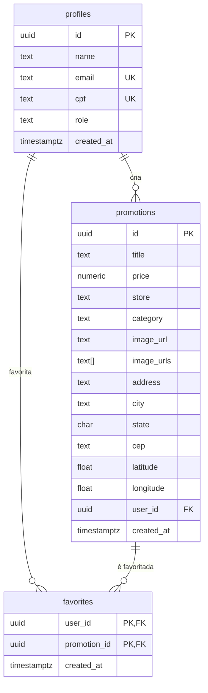
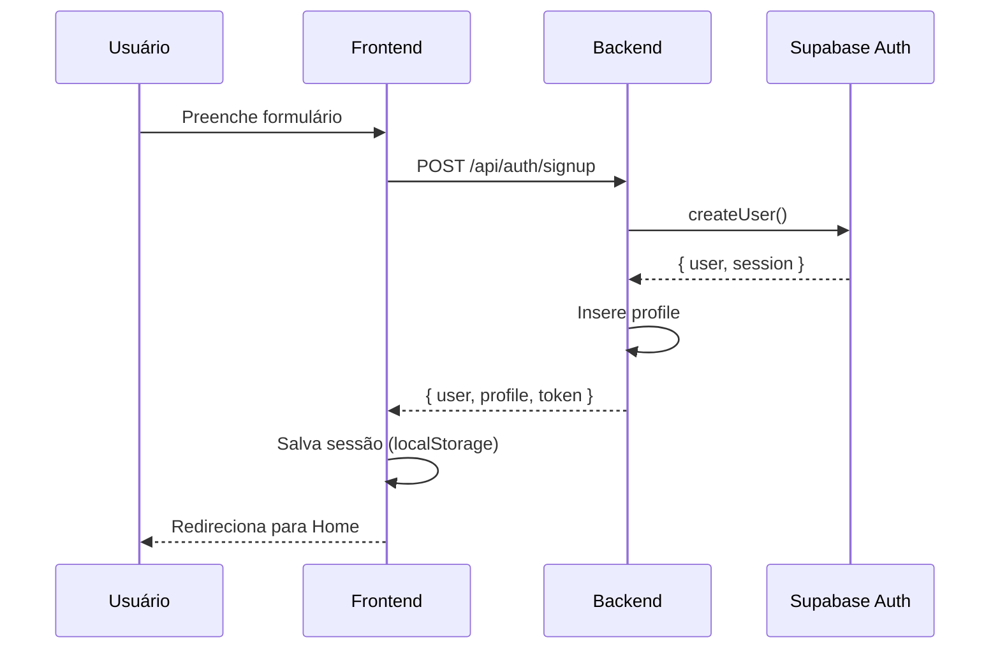

# Arquitetura — App Promoções

## Visão Geral

Aplicação full-stack com três camadas:

```
┌─────────────────────────────────────────────────────┐
│  Frontend (React + Vite + TypeScript + Tailwind)    │
│  http://localhost:5173                               │
└──────────────────────┬──────────────────────────────┘
                       │ HTTP/REST
┌──────────────────────▼──────────────────────────────┐
│  Backend (Node.js + Express + TypeScript)            │
│  http://localhost:3333                               │
└──────────────────────┬──────────────────────────────┘
                       │ Supabase SDK
┌──────────────────────▼──────────────────────────────┐
│  Supabase (PostgreSQL + Auth + Storage)             │
│  https://yncaphywduspgiinmsup.supabase.co           │
└─────────────────────────────────────────────────────┘
```

## Stack Tecnológica

| Camada | Tecnologia | Função |
|--------|-----------|--------|
| Frontend | React 18 + TypeScript | UI e interação |
| Frontend | Vite | Build e dev server |
| Frontend | Tailwind CSS | Estilização |
| Frontend | React Router v6 | Roteamento SPA |
| Frontend | React Hook Form + Zod | Validação de formulários |
| Frontend | react-leaflet | Mapa interativo |
| Backend | Node.js + Express | API REST |
| Backend | TypeScript | Tipagem estática |
| Backend | Multer | Upload de arquivos |
| Database | Supabase PostgreSQL | Persistência |
| Auth | Supabase Auth | JWT + sessões |
| Storage | Supabase Storage | Imagens |

## Modelo de Dados



## Fluxo de Autenticação



## Estrutura de Diretórios

```
app-promocoes/
├── frontend/src/
│   ├── components/
│   │   ├── features/    # Componentes de negócio
│   │   ├── layout/      # Header, Footer, PageWrapper
│   │   └── ui/          # Button, Card, Input, Skeleton
│   ├── pages/           # Páginas (rotas)
│   ├── contexts/        # AuthContext
│   ├── hooks/           # useAuth, usePromotions, useFavorites
│   ├── services/        # API, auth, geolocation, storage
│   ├── types/           # Interfaces TypeScript
│   ├── constants/       # Categorias
│   └── utils/           # Formatters, validators
├── backend/src/
│   ├── routes/          # Express routes
│   ├── middlewares/     # Auth, error handler
│   ├── services/        # Supabase client
│   └── types/           # Interfaces
├── database/            # SQL schemas
└── docs/                # Documentação
```

## Padrões Utilizados

- **Services Pattern**: Lógica de API isolada em services
- **Custom Hooks**: Encapsulam lógica de estado (usePromotions, useFavorites)
- **Context API**: Estado global de autenticação
- **Middleware Pattern**: Auth e error handling no Express
- **RLS (Row Level Security)**: Segurança a nível de banco

## Decisões Arquiteturais

| Decisão | Motivo |
|---------|--------|
| Supabase em vez de Firebase | PostgreSQL, RLS nativo, SDK simples |
| Tailwind em vez de CSS Modules | Produtividade, responsividade, dark theme |
| react-leaflet em vez de Google Maps | Gratuito, sem API key |
| Nominatim em vez de Google Geocoding | Gratuito, sem limites rígidos |
| Express em vez de acesso direto ao Supabase | Controle de lógica, upload de imagens |
