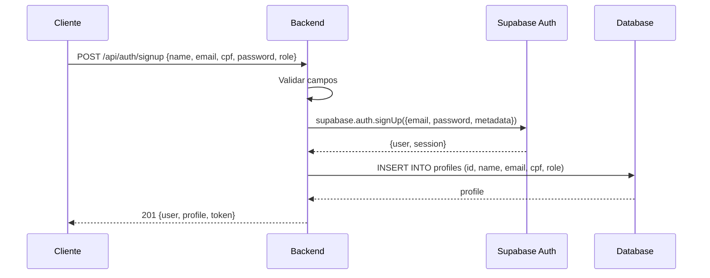
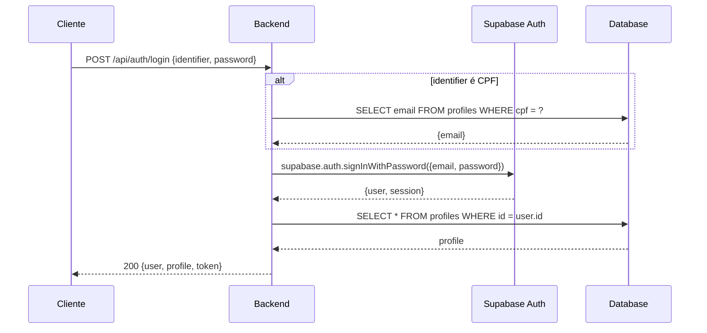
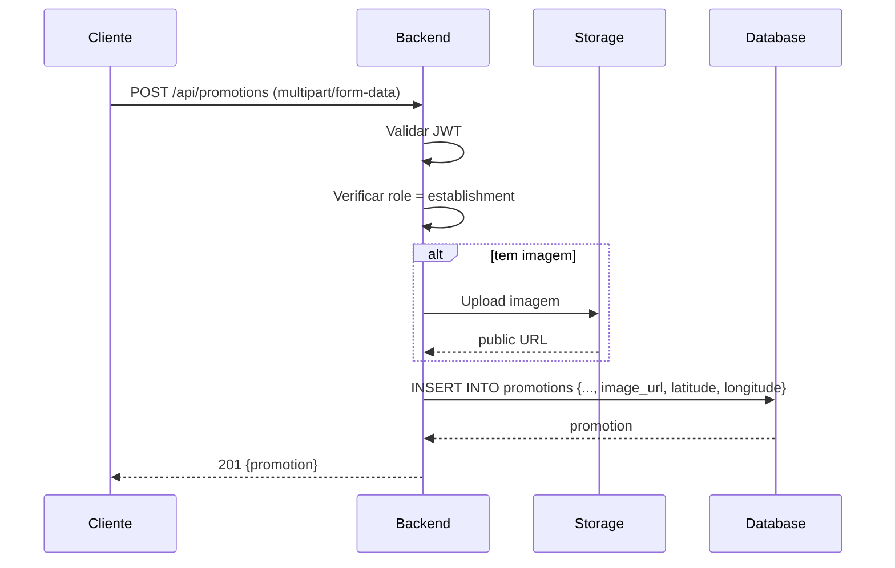
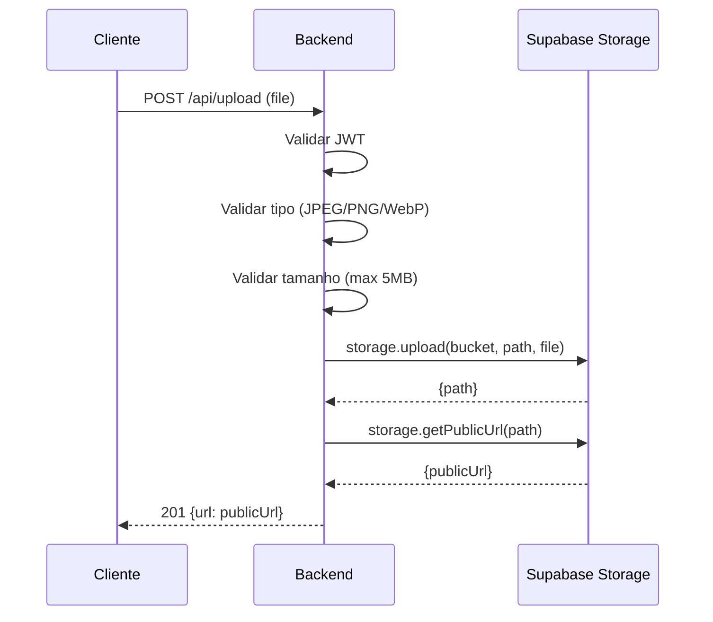
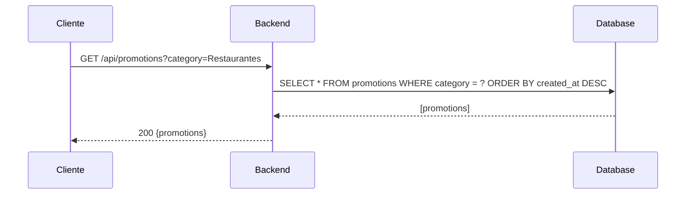
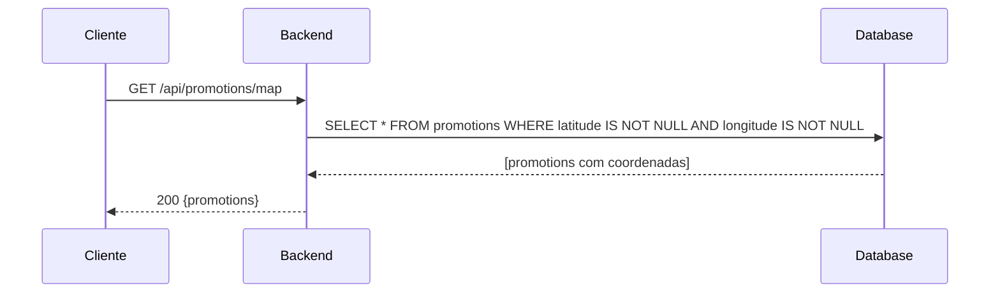
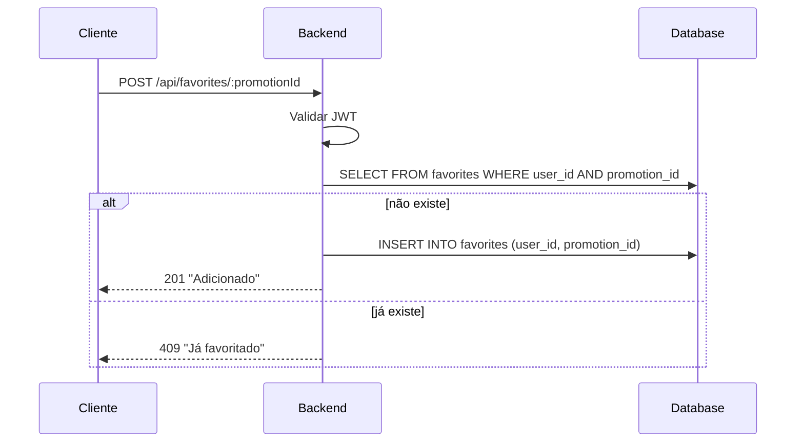
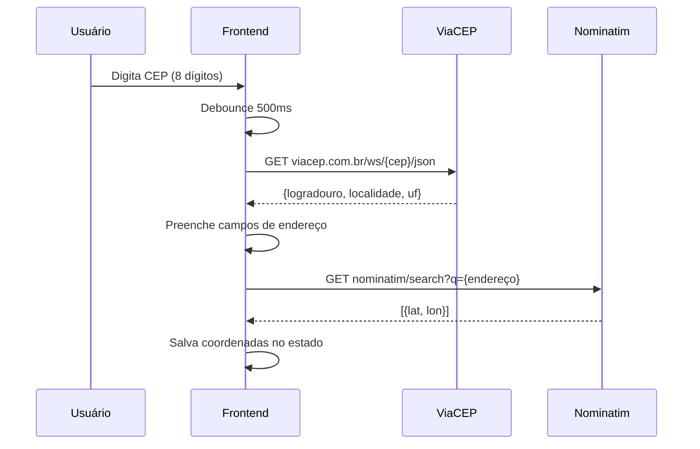
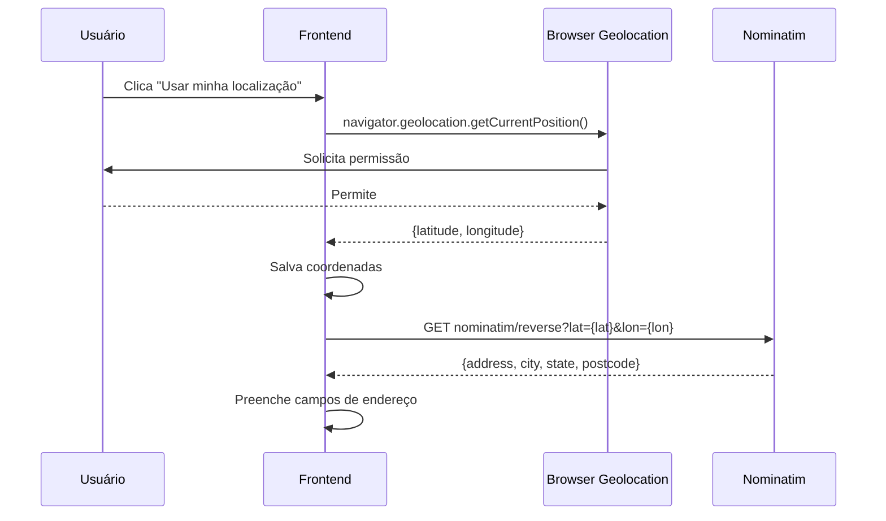
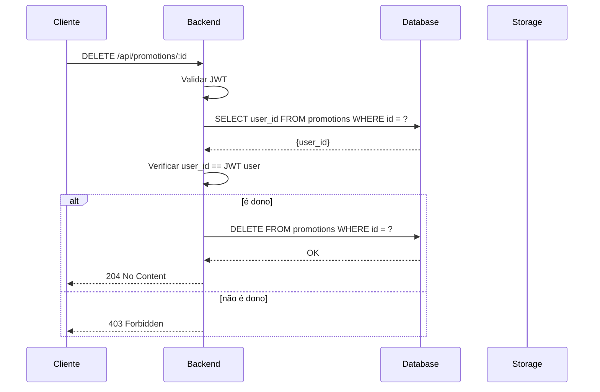

# Diagramas de Fluxo da API

## Signup (Cadastro)

## Login

## Criar Promoção

## Upload de Imagem

## Buscar Promoções

## Buscar Promoções com Localização (Mapa)

## Favoritar/Desfavoritar

## Geolocalização (CEP)

## Geolocalização (GPS)

## Deletar Promoção

